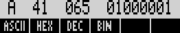
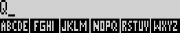
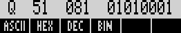
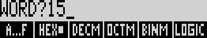
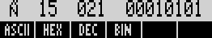

This is the base conversion program contributed by Ton van de Burgt to the
[Free42 Software Collection](http://thomasokken.com/free42/42progs/index.html)

---

# Base
A program for viewing several bases together.

## Usage

The program shows the ASCII character, the Hexadecimal value, the Decimal value and the Binary value.
The maximum value of the word is 1 byte: "FF" in Hex, 255 in Dec, 1111.1111 in Bin.
- Pressing [ASCII] you can enter a new ASCII value
- Pressing [HEX] you can enter a new Hexadecimal value
- Pressing [DEC] you can enter a new Decimal value
- Pressing [BIN] you can enter a new Binary value

## Example
Press [ASCII] and enter a "Q":

Press [R/S] and the several bases are displayed:

Press [HEX] and enter "15"

Press [R/S] and the several bases are displayed:

